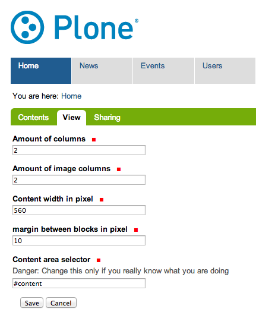
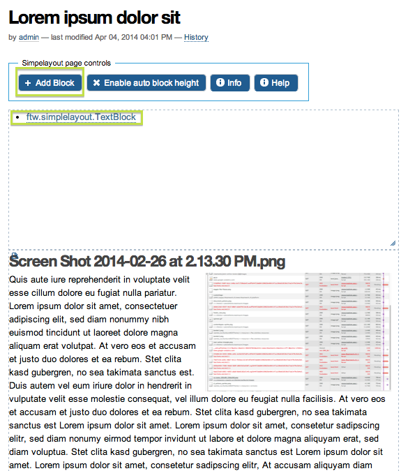
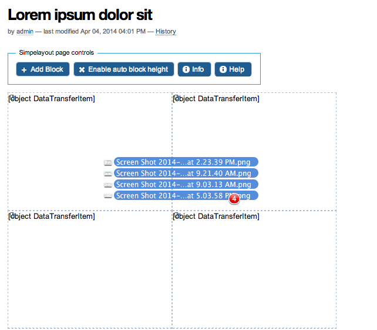

.. contents:: Table of Contents

Introduction
============

SimpleLayout provides an intuitive way of adding and arranging the different
elements of a page such as paragraphs, images, files and links using
drag-and-drop functionality.
These elements are implemented as addable and easily arrangeable "blocks".
Because of the restricted dimensions of text, images and other content elements,
the general result is content with a uniform look and feel throughout the site.

Compatibility
-------------

Plone 4.3.x

.. image:: https://jenkins.4teamwork.ch/job/ftw.simplelayout-master-test-plone-4.3.x.cfg/badge/icon
   :target: https://jenkins.4teamwork.ch/job/ftw.simplelayout-master-test-plone-4.3.x.cfg

Installation
============

- Add the package to your buildout configuration:

::

    [instance]
    eggs +=
        ...
        ftw.simplelayout

Then you got several profile from wich you can choose from:

- ``ftw.simplelayout`` default profile - Installs everything you need include default
  DX based content types to start with

- ``ftw.simplelayout`` example profile - Like the default profile, but install more
  simplelayout views for testing. Do not install this profile on a production side.

- ``ftw.simplelayout`` js lib profile - Only installs the JS library and the control panel.
  No example content, no further views.

- ``ftw.simplelayout`` development profile - Installs the default profile, but registers
  the not uglified js version of jquery.simplelayout.

Usage
=====

First steps
-----------

First thing you should do is to configure the default simplelayout behavior.
To achieve this, go to the Simplelayout control panel
(`@@simplelayout-controlpanel`) and configure for example the amount of columns
and images you want to display by default.

   Simplelayout control panel

**Changing those settings after creating some content may break the simplelayout
view and put it in a inconsistent state.** It's not yet clear how smplelayout
should behave on changing those settings, please check or join the discussion
on `github <https://github.com/4teamwork/ftw.simplelayout/issues/33>`_.

Contenttypes
------------

Simplelayout ships by default with two content types.
One folderish type, the `ContentPage` and one block type, the `TextBlock`.

**ContentPage**

The ContentPage is a simple folderish dexterity based contenttype, which
does nearly nothing, but has the ``@@simplelayout`` view configured by default.
It's possible to add a ContentPage within a ContentPage

**TextBlock**

The TextBlock provides the following fields:

- ``Title`` (Well, this will be the title of the block, rendered as **h2**).
- Show title? (Decide if the title will be displayed or not).
- Text
- Image

Title, or Text, or the image is needed to successfully add a new block

The ``TextBlock`` configuration allows you to use this block to show text
only or images only, or of course both. There's no need of a single block for
images and a single block for text.

.. figure:: ./docs/_static/add_textblock.png
   :align: center
   :alt: Add TextBlock

   Add TextBlock

Add new TextBlock
-----------------

Create a simpelayout ContentPage first...

You have two possibilities how to add a new TextBlock:

First:

Click on the ``Add Block`` link.
A Placeholder block is added to your simplelayout page.
By default the block is added on top as first block.
You can move this placeholder around until it's on the right place.
After that, chose a block type to add (Currently only one block is available).

   Add block

Second - the cool way:

Drag one or more images (NOT other files) over the simplelayout page.
While dragging you can see where the images will be uploaded after dropping.
By default the with of the block is 1 column.
After the image upload you can move the images around, add text, or a title.

   Dnd upload of images

Simplelayout your site
----------------------

**Yes it's simple:**

- Resize blocks on the left, bottom, or left-bottom corner.
- Drag and drop blocks.
- Resize images in blocks.

**What's special:**

- Resizing a block will also resize the image in the block.
- The blocks are not simply floated, they are bricks in a wall (masoned).
- You can resize the block only within the configured boundaries.
- It's somehow responsive :-)
- By enabled the "auto block height" feature in the "Simplelayout page controls"
  area, every modified block, will automatically consume as much space as needed
  to display all data.
- SearchableText of blocks is indexed in the searchableText of the ISimplelayout container (ex. ContentPage)

Develop
-------

**Python:**

1. Fork this repo
2. Clone your fork
3. Shell: ``ln -s development.cfg buidlout.cfg``
4. Shell: ``python boostrap.py``
5. Shell: ``bin/buildout``

After that you can run tests by excute the following command on a shell: ``bin/test``.

Or start an instance by running ``bin/instance fg``.

**JQuery Simplelayout plugin:**

1. Fork this repo
2. Clone your fork
3. Install node.js on your system
4. Shell: ``cd ftw/simplelayout/resources/js``
5. Shell: ``make bootstrap``
6. Shell: ``make test``

``make watch`` will automatically run the tests if you make any changes.

Links
=====

- Main github project repository: https://github.com/4teamwork/ftw.simplelayout
- Issue tracker: https://github.com/4teamwork/ftw.simplelayout/issues
- Package on pypi: http://pypi.python.org/pypi/ftw.simplelayout
- Continuous integration: https://jenkins.4teamwork.ch/search?q=ftw.simplelayout

Copyright
=========

This package is copyright by `4teamwork <http://www.4teamwork.ch/>`_.

``ftw.simplelayout`` is licensed under GNU General Public License, version 2.

.. image:: https://cruel-carlota.pagodabox.com/a2410563766c51d4390fb7738fe40999
   :alt: githalytics.com
   :target: http://githalytics.com/4teamwork/ftw.simplelayout
