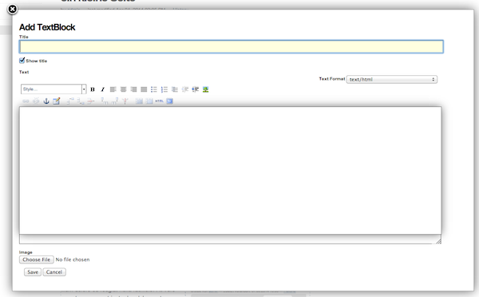

.. contents:: Table of Contents

Introduction
============

SimpleLayout provides an intuitive way of adding and arranging the different
elements of a page such as paragraphs, images, files and links using
drag-and-drop functionality.
These elements are implemented as addable and easily arrangeable "blocks".
Because of the restricted dimensions of text, images and other content elements,
the general result is content with a uniform look and feel throughout the site.

Compatibility
-------------

**Plone 4.3.x**

.. image:: https://jenkins.4teamwork.ch/job/ftw.simplelayout-master-test-plone-4.3.x.cfg/badge/icon
   :target: https://jenkins.4teamwork.ch/job/ftw.simplelayout-master-test-plone-4.3.x.cfg

**Themes**

To have proper styles we recommend using `plonetheme.blueberry <https://github.com/4teamwork/plonetheme.blueberry/>`_.

**Plone 5**

Plone 5 is supported but without any default contenttypes.

Installation
============

- Add the package to your buildout configuration (Plone 4.3.x with ContentTypes):

::

    [instance]
    eggs +=
        ...
        ftw.simplelayout[contenttypes]

- With mapblock:

::

    [instance]
    eggs +=
        ...
        ftw.simplelayout[contenttypes, mapblock]

- Or wihtout any extras (Plone 5 is supported):

::

    [instance]
    eggs +=
        ...
        ftw.simplelayout

Then you got several profile from wich you can choose from:

- ``ftw.simplelayout`` **lib** profile - Just the basics without any ContentTypes. This profile is also available for Plone 5

- ``ftw.simplelayout`` **default** profile - Installs Simplelayout with default ContentTypes and everything you need to create content the Simplelayout way.

- ``ftw.simplelayout`` **development** profile - Installs non minified versions of *simplelayout.js* and *simplelayout.css* - for DEV environments. You need to install this profile on top of lib or the default profile

- Overlays for manipulate blocks, such as adding, deleting and modifying.
- Saving the current Simplelayout state.
- Loading the configuration of a simplelayout page.
- Reloading blocks with additional parameters, view, or data attributes.

Usage
=====

First steps
-----------

It's a good idea to install the default profile, which ships some basic contenttypes, such as ContentPage and TextBlock.

Simply add a new ContentPage instead of a Plone Document. A Toolbox appears on right, which allows you to create content on/in your ContentPage with Simplelayout.

By default you can choose between a 1 column, 2 Column or 4 Column layout.
Simplelayout adds an empty 1 column layout for you by default, so you can directly start adding a Block.

Just drag the Block of your choice, for example a TextBlock, into the layout. Enter title, body text and/or an image. Then click save.

As you see, you never going to leave the ContentPage, all actions with Simplelayout are asynchronous.
This means adding, deleting and editing always opens an overlay, where you can make the modifications.

Contenttypes
------------

Simplelayout ships by default with two content types.
One folderish type, the `ContentPage` and one block type, the `TextBlock`.

**ContentPage**

The ContentPage is a simple folderish dexterity based contenttype, which
does nearly nothing, but has the ``@@simplelayout-view`` view configured by default.
It's possible to add a ContentPage within a ContentPage

**TextBlock**

The TextBlock provides the following fields:

- ``Title`` (Well, this will be the title of the block, rendered as **h2**).
- Show title? (Decide if the title will be displayed or not).
- Text
- Image

Title, or Text, or the image is needed to successfully add a new block

The ``TextBlock`` configuration allows you to use this block to show text
only or images only, or of course both. There's no need of a single block for
images and a single block for text.

   Add TextBlock

Behaviors
---------

- The Teaser behavior is enabled by default on `TextBlock`. It allows you to add an
  internal or external link to the block.

- The `show_title` behavior is disabled by default. It can be enabled to add a checkbox
  to the configuration of contentpages. With this checkbox, the title can be hidden.

Portlets
--------

``ftw.simplelayout`` provides a ``Simplelayout Portlet`` which alows you to move Blocks into the right, or left column.
You simply have to assign the portlet on a specific context, or type.

Example (How to assign the portlet by default to all Simplelayout ContentPages).

portlets.xml:

.. code-block:: xml

    <?xml version="1.0"?>
    <portlets>
        <assignment
          manager="plone.rightcolumn"
          category="content_type"
          key="ftw.simplelayout.ContentPage"
          type="ftw.simplelayout.portlet"
          insert-before="*">
        </assignment>
    </portlets>

Simplelayout your site
----------------------

**Yes it's simple:**

- Add layouts by Drag'n'Drop
- Add Blocks by Drag'n'Drop
- Upload images directly by Drag'n'Drop [Comming soon]
- Change representation of blocks directly on the Block itself
- Responsive by default
- Create multiple column pages with ease.
- Uninstall profile

Development
===========

**Python:**

1. Fork this repo
2. Clone your fork
3. Shell: ``ln -s development.cfg buidlout.cfg``
4. Shell: ``python boostrap.py``
5. Shell: ``bin/buildout``

Run ``bin/test`` to test your changes.

Or start an instance by running ``bin/instance fg``.

Create new Block
----------------

Make your content blockish, needs only two steps.

1. The only difference between a block and other DX content types is the ``SimplelayoutBlockBehavior``. You can simply add the Block behavior to your content by adding the following line to FTI:

.. code-block:: xml

    <property name="behaviors">
        <element value="ftw.simplelayout.interfaces.ISimplelayoutBlock" />
    </property>

2. In order you block knows how to represent himself on a simplelayout page you need to register a ``block_view`` for your Block.

Register view with zcml:

.. code-block:: xml

    <browser:page
        for="my.package.content.IMyBlock"
        name="block_view"
        permission="zope2.View"
        class=".myblock.MyBlockView"
        template="templates/myblockview.pt"
        />

Corresponding template:

.. code-block:: html

      <h2 tal:content="context/Title">Title of block</h2>

      <!-- Assume you got a text field on your content -->
      

Well basically that's it :-) You just created a new block!!

Create custom actions for Blocks
--------------------------------

Global Simplelayout configuration
---------------------------------

Create new Block representations
--------------------------------

Directly edit items in a folderish block
----------------------------------------

For this purpose you can place a link in the rendered block.
Assume you want to edit a file in a listing block: you need a link, which is pointing to ``./sl-ajax-inner-edit-view``,
has the css class ``inneredit`` and a data attribute named ``uid`` containing the uid of the content.

.. code-block:: xml

    <a href="./sl-ajax-inner-edit-view"
       class="inneredit"
       tal:attributes="data-uid file_object/UID">EDIT</a>

After editing the content, the view automatically reloads the block.

Run custom JS code
==================

Some Blocks need to run some JS code after rendering or for the widget itself while adding/editing. For this use case you can simply listen to the jquerytools overlay events.

Run JS after adding and editing a Block
---------------------------------------

This example has been taken from the MapBlock.
It uses the ``onBeforeClose`` event of jquerytools Overlay to load the collectivegeo map.

.. code-block:: Javascript

    $(function(){
      $(document).on('onBeforeClose', '.overlay', function(){
        if ($.fn.collectivegeo) {
          $('.widget-cgmap').filter(':visible').collectivegeo();
        }
      });
    });

Run JS after the overlay has been displayed
-------------------------------------------

This example has been taken from the MapBlock.
It uses the ``onLoad`` event of jquerytools Overlay to load the collectivegeo map in edit mode.

.. code-block:: Javascript

    $(function(){
      $(document).on('onLoad', '.overlay', function(){
        if ($.fn.collectivegeo) {
          var maps = $('.widget-cgmap').filter(':visible');
          var map_widgets = $('.map-widget .widget-cgmap').filter(':visible');
          maps.collectivegeo();
          map_widgets.collectivegeo('add_edit_layer');
          map_widgets.collectivegeo('add_geocoder');
        }
      });
    });

More JS events
--------------

jQueryTools Overlay provides two more events:

- onBeforeLoad
- onClose

Check `jQueryTools Overlay Documentation <http://jquerytools.github.io/documentation/overlay>`_

Modify the Simplelayout configuration
-------------------------------------

The simplelayout JS lib can be modified by  the `data-sl-settings` on the simplelayout container. Currently supported settings:

- layouts
- canChangeLayouts

1. You're able to modify those settings globally through the Simplelayout control panel. For example:

.. code-block:: JSON

    {"layouts": [1]}

All Simplelayout sites are configured to have only 1 column Layouts

2. Using a ISimplelayoutContainerConfig Adapter, which adapts a `context` and `request`, which means you can have different settings for different Simplelayout enabled types.

Example:

.. code-block:: Python

    from ftw.simplelayout.contenttypes.contents.interfaces import IContentPage
    from ftw.simplelayout.interfaces import ISimplelayoutContainerConfig

    class ContenPageConfigAdapter(object):
        implements(ISimplelayoutContainerConfig)

        def __init__(self, context, request):
            pass

        def __call__(self, settings):
            settings['layouts'] = [1]

        def default_page_layout():
            return None

    provideAdapter(ContenPageConfigAdapter,
                   adapts=(IContentPage, Interface))

Note 1: The adapter gets called with the settings Dictionary, so you don't have to return it.

Note 2: With the ``default_page_layout`` method you can also define default layouts, which are pre renderd on a empty page.

3. Using the View itself, by overwrite the ``update_simplelayout_settings`` method.

.. code-block:: Python

    from ftw.simplelayout.browser.simplelayout import SimplelayoutView

    class CustomSimplelayoutView(SimplelayoutView):

        def update_simplelayout_settings(self, settings):
            settings['layouts'] = [1, 4]

4. By default the ``canChangeLayouts`` option is injected by the Simplelayout provider. It checks if the current logged in user has the ``ftw.simplelayout: Change Layouts`` permission.

OpenGraph support
-----------------
Simplelayouts provides a basic `OpenGraph <http://ogp.me/>`_ integration.
You can disable (Simplelayout Settings - Control Panel) Opengraph for the plone root as you wish, because it's enabled by default.
On Simplelayout sites itself the OpenGraph meta tags can be controlled by the `OpenGraph marker behavior`.

Migration from ftw.contentpage
==============================

This package is the successor of
`ftw.contentpage <https://github.com/4teamwork/ftw.contentpage>`_.
In order to migrate from `ftw.contentpage` types to `ftw.simplelayout` types,
take a look at the preconfigured inplace migrators in the `migration.py` of
`ftw.simplelayout`.

Client Library
==============

Building
--------

Rebuilding the library (resources/ftw.simplelayout.js):

.. code-block:: bash

    grunt dist

Watching for changes and rebuild the bundle automatically:

.. code-block:: bash

    grunt dev

or the default task

.. code-block:: bash

    grunt

Testing
-------

Running all test:

.. code-block:: bash

    npm test

or

.. code-block:: bash

    grunt test

Running a specific test:

.. code-block:: bash

    grunt test --grep="Name of your test"

Getting started
---------------

Toolbox
-------

Provide a toolbox instance for the simplelayout.

.. code-block:: javascript

    var toolbox = new Toolbox({
      layouts: [1, 2, 4],
      canChangeLayout: true, // Decides if toolbox get rendered
      blocks: [
        { title: "Textblock", contentType: "textblock", formUrl: "URL",
          actions: {
            edit: {
              class="edit",
              description: "Edit this block",
              someCustomAttribute: "someCustomValue"
            },
            move: {
              class: "move",
              description: "Move this block"
            }
          }
        },
        { title: "Listingblock", contentType: "listingblock", formUrl: "URL" }
      ],
      layoutActions: {
        actions: {
          move: {
            class: "iconmove move",
            title: "Move this layout arround."
          },
          delete: {
            class: "icondelete delete",
            title: "Delete this layout."
          }
        }
      },
      labels: {
        labelColumnPostfix: "Column(s)" // Used for label in toolbox
      }
    });

Blocks
------

+-------------+-------------+------------------------------------+
| key         | is required | description                        |
+-------------+-------------+------------------------------------+
| title       |             | Title in the toolbox               |
+-------------+-------------+------------------------------------+
| description |             | Used for titleattribute            |
+-------------+-------------+------------------------------------+
| contentType | ✓           | Represents the type for each block |
+-------------+-------------+------------------------------------+
| actions     | ✓           | Describes the actions              |
+-------------+-------------+------------------------------------+

Actions
-------

+-------------+-------------+------------------------------------+
| key         | is required | description                        |
+-------------+-------------+------------------------------------+
| key         | ✓           | Name for the action                |
+-------------+-------------+------------------------------------+
| class       |             | Classattribute for the action      |
+-------------+-------------+------------------------------------+
| description |             | Used for title attribute           |
+-------------+-------------+------------------------------------+
| custom      |             | Will be provided as data attribute |
+-------------+-------------+------------------------------------+

Simplelayout
------------

Use toolbox instance for initializing a simplelayout.

.. code-block:: javascript

    var simplelayout = new Simplelayout({toolbox: toolbox});

Deserialize
-----------

Use existing markup for deserializing the simplelayout state.

Provided HTML Structure

.. code-block:: html

    

      

        

          

            

          

        

        

          

            

          

        

        

          

            

              
I am a textblock

            

          

        

        

      

    

Make sure that each datatype in the structure is covered in the toolbox.

Events
------

Attach events using the singleton instance of eventEmitter.

.. code-block:: javascript

    var simplelayout = new Simplelayout({toolbox: toolbox});
    simplelayout.on(eventType, callback);

Eventtypes
----------

blockInserted(block)

blockCommitted(block)

blockRollbacked(block)

beforeBlockMoved(block)

blockMoved(block)

blockDeleted(block)

layoutInserted(layout)

layoutCommitted(layout)

layoutRollbacked(layout)

layoutMoved(layout)

layoutDeleted(layout)

DOM properties
--------------

Each block and layout is represented in the DOM through an ID.

Each DOM element provides the following properties:

- object --> object representation in simplelayout
- parent --> parent object representation in simplelayout
- id --> generated UUID for this element
- represents --> representer from origin (empty if object only exists local)

These properties can get extracted as a jQueryElement:

.. code-block:: javascript

    var block = $(".sl-block").first();
    var blockObj = block.data().object;

TODO
====
- Update/Finish examples.
- Update/Add images (animated gifs).
- Improve Plone 5 support (probably with plone 5 contentttypes).
- Archetypes block integration (for legacy packages).

Links
=====

- Github: https://github.com/4teamwork/ftw.simplelayout
- Issues: https://github.com/4teamwork/ftw.simplelayout/issues
- Pypi: http://pypi.python.org/pypi/ftw.simplelayout
- Continuous integration: https://jenkins.4teamwork.ch/search?q=ftw.simplelayout

Copyright
=========

This package is copyright by `4teamwork <http://www.4teamwork.ch/>`_.

``ftw.simplelayout`` is licensed under GNU General Public License, version 2.
